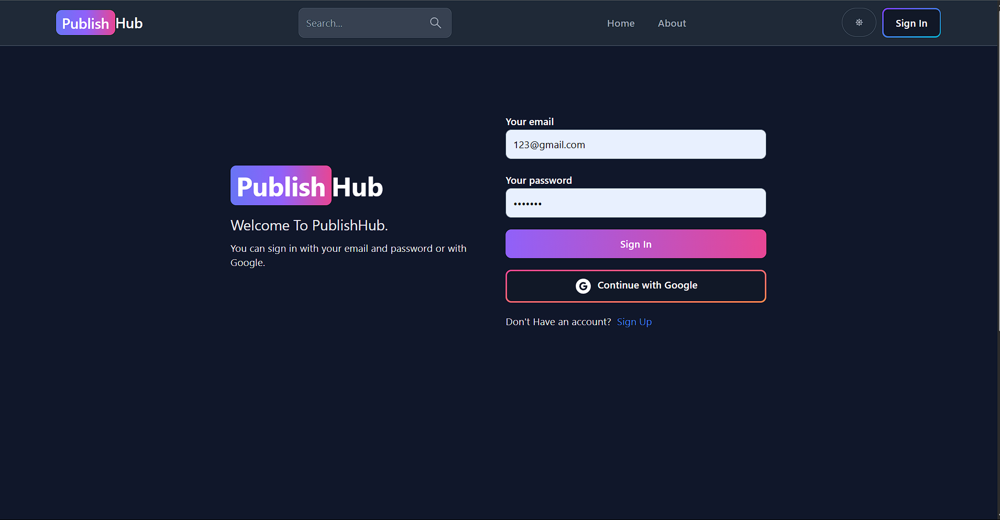
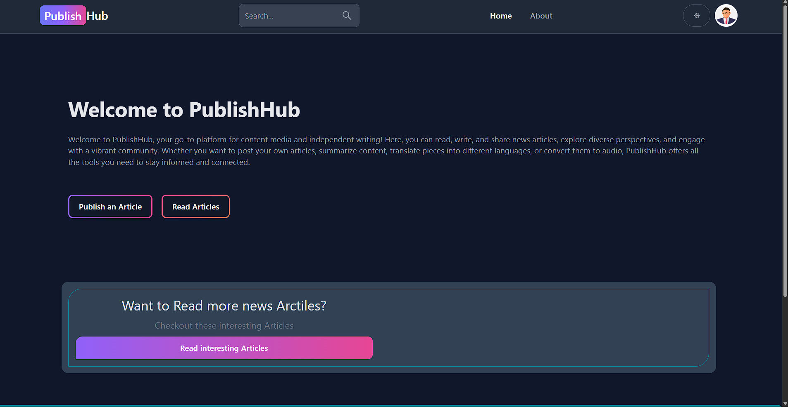
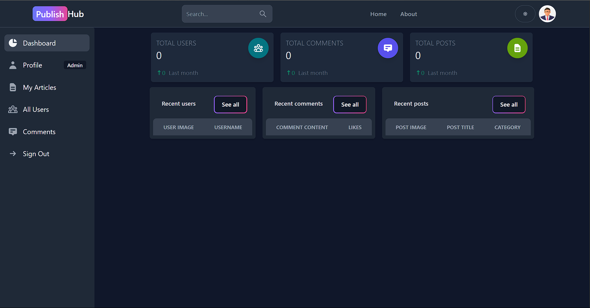
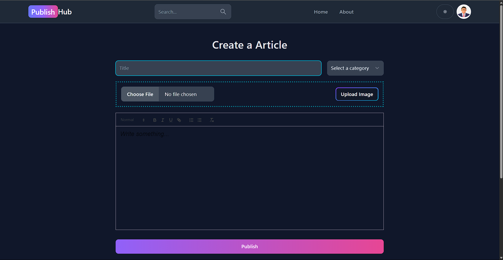
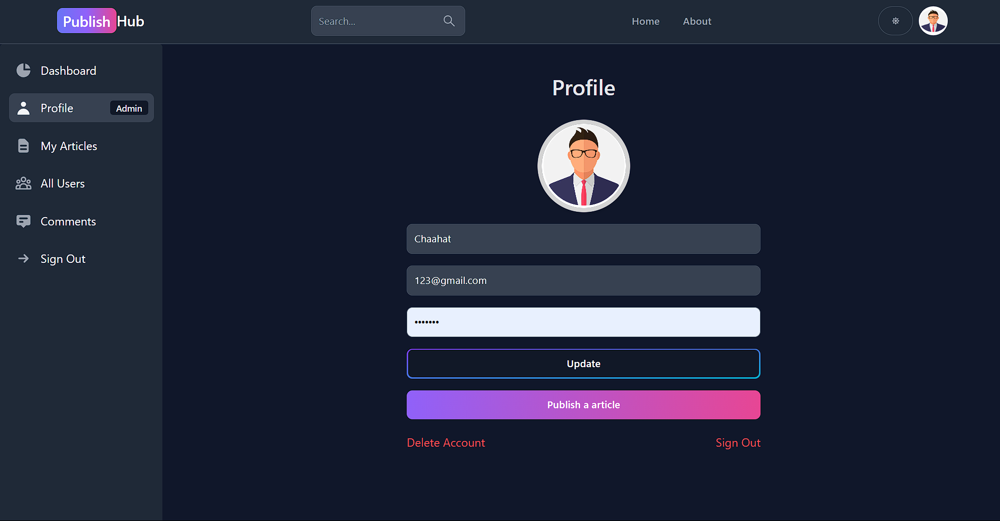
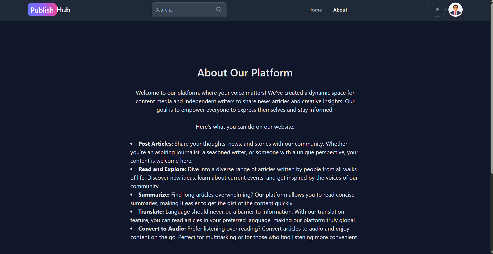

# 📰 PublishHub - Blogging Platform

### 🗂️ Pages Overview

### 🔐 **Authentication**

- **Sign Up / Sign In**  
  Register or log in using email and password to access dashboard features.

### 🏠 **Home Page**

- Displays recent and popular blog articles in card format with search functionality.

### 📂 **Dashboard**

- Admin area to manage posts, users, and comments. Contains multiple tabbed sections.

### 📝 **Create / Update Post**

- Rich text editor for posting blogs with cover image, title, and content formatting.

### 👤 **Profile**

- Update username, email, and other user preferences. Also delete your account.

### 📃 **About**

- Static page with app details and developer information.

---

## 📌 About the Project

**PublishHub** is a full-stack blogging platform where users can create, manage, and interact with blog posts. It features user authentication, real-time comments, AI-powered summarization, text-to-speech, and Google Translate integration.

---

## 🚀 Features

- 🔐 User Authentication (Sign Up / Sign In)
- 📝 Rich Text Blog Editor
- 🧠 AI Summarization (via Hugging Face BART)
- 🔊 Text-to-Speech (FastSpeech2)
- 🌐 Multilingual Translation (Google Translate API)
- 💬 Comments Section
- 🧑‍💼 Admin Dashboard for managing posts/users
- 🌙 Dark Mode support

---

## 🖥️ Tech Stack

**Frontend:** React, Tailwind CSS, Flowbite-React  
**Backend:** Node.js, Express  
**Database:** MongoDB  
**APIs:**

- Hugging Face Inference API
- Google Translate API
- Firebase (for OAuth)

---

## 🧩 Folder Structure
